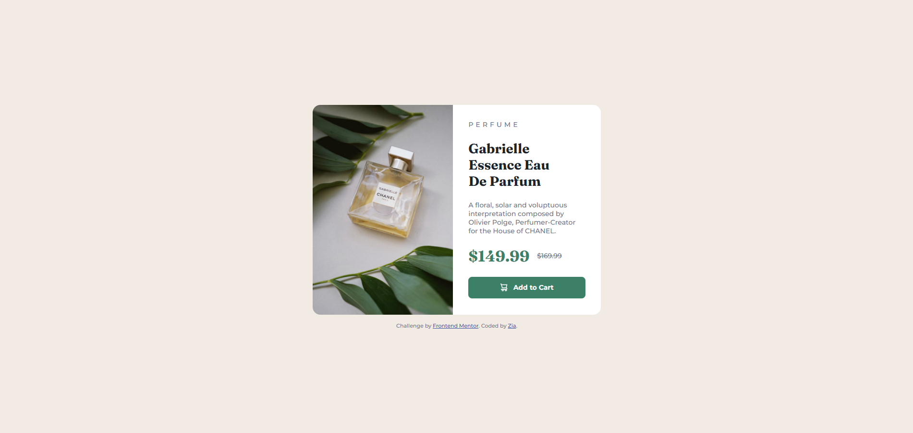

# Frontend Mentor - Product preview card component solution

This is a solution to the [Product preview card component challenge on Frontend Mentor](https://www.frontendmentor.io/challenges/product-preview-card-component-GO7UmttRfa). Frontend Mentor challenges help you improve your coding skills by building realistic projects.

## Table of contents

- [Overview](#overview)
  - [The challenge](#the-challenge)
  - [Screenshot](#screenshot)
  - [Links](#links)
- [My process](#my-process)
  - [Built with](#built-with)
  - [What I learned](#what-i-learned)
  - [Continued development](#continued-development)
- [Author](#author)

## Overview

### The challenge

Users should be able to:

- View the optimal layout depending on their device's screen size
- See hover and focus states for interactive elements

### Screenshot



### Links

- Solution URL: [Add solution URL here](#)
- Live Site URL: [Add live site URL here](#)

## My process

### Built with

- Semantic HTML5 markup (`<main>`, `<article>`, `<picture>`)
- CSS custom properties (Variables)
- Flexbox (Row layout for desktop, column layout for mobile)
- Responsive Art Direction using the HTML5 `<picture>` element
- Custom typography with Google Fonts (`Fraunces` and `Montserrat`)

### What I learned

In this challenge, I practiced building a responsive two-column product card that switches seamlessly between mobile and desktop views using CSS Flexbox. I also learned how to use the HTML5 `<picture>` element to swap between desktop and mobile images efficiently, as well as applying CSS typography rules like `text-transform: uppercase`, `letter-spacing`, and `text-decoration: line-through`.

To see how you can add code snippets, see below:

```html
<picture>
  <source
    media="(max-width: 600px)"
    srcset="./images/image-product-mobile.jpg"
  />
  
</picture>
```

```css
.card {
  display: flex;
  flex-direction: row;
  max-width: 600px;
  background-color: var(--white);
  border-radius: 1rem;
  overflow: hidden;
}
@media (max-width: 600px) {
  .card {
    flex-direction: column;
    max-width: 340px;
    margin: 1rem;
  }
}
.category {
  text-transform: uppercase;
  letter-spacing: 5px;
  color: var(--gray);
}
.original-price {
  color: var(--grey);
  text-decoration: line-through;
}
```

### Continued development

- Advanced responsive layouts using CSS Grid.
- Interactive cart functionality with JavaScript.
- Further accessibility enhancements (such as screen reader announcements for discounted prices).

## Author

- Frontend Mentor - [@zia](https://www.frontendmentor.io/profile/zzeeyyaa)
